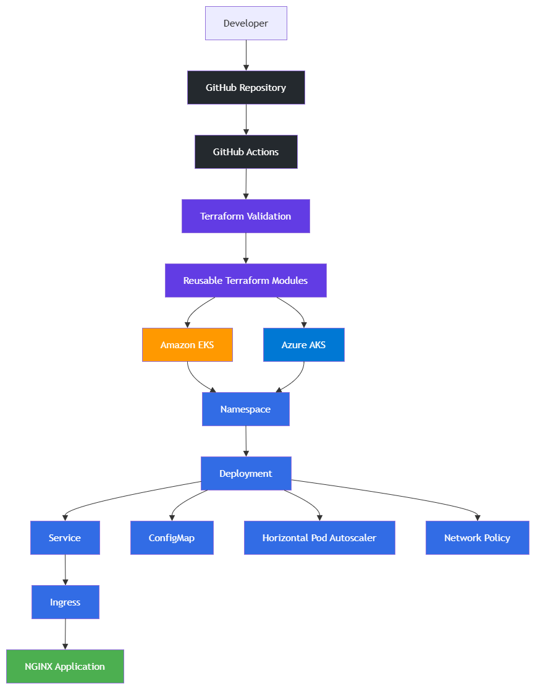

# Multi-Cloud Kubernetes Platform

A reusable Infrastructure as Code (IaC) project that provisions Kubernetes clusters on **Amazon EKS** and **Microsoft Azure AKS** using **Terraform**, along with Kubernetes application manifests and automated validation using **GitHub Actions**.

This repository demonstrates how to build and manage a consistent Kubernetes platform across multiple cloud providers while following Infrastructure as Code best practices.

---

## Features

- Provision Amazon EKS using reusable Terraform modules
- Provision Azure AKS using reusable Terraform modules
- Separate Development and Production environments
- Reusable Terraform module design
- Kubernetes application deployment
- ConfigMap for application configuration
- ClusterIP Service
- NGINX Ingress
- Horizontal Pod Autoscaler (HPA)
- Kubernetes Network Policy
- GitHub Actions workflow for Terraform validation
- Clean repository structure suitable for real-world projects

---

## Technologies Used

| Category               | Technology                |
| ---------------------- | ------------------------- |
| Infrastructure as Code | Terraform                 |
| Cloud Provider         | Amazon Web Services (AWS) |
| Cloud Provider         | Microsoft Azure           |
| Kubernetes             | Amazon EKS                |
| Kubernetes             | Azure AKS                 |
| CI/CD                  | GitHub Actions            |
| Container              | Docker / NGINX            |
| Version Control        | Git                       |
| Configuration          | YAML                      |

---

# Architecture

The repository provisions Kubernetes infrastructure on both AWS and Azure using reusable Terraform modules. A sample NGINX application is then deployed using Kubernetes manifests.

```text
                        GitHub Repository
                               │
                               ▼
                       GitHub Actions
                               │
                    Terraform Validation
                               │
               ┌───────────────┴───────────────┐
               │                               │
               ▼                               ▼
         Amazon Web Services             Microsoft Azure
               │                               │
               ▼                               ▼
             Amazon EKS                    Azure AKS
               │                               │
               └───────────────┬───────────────┘
                               │
                               ▼
                     Kubernetes Resources
                               │
        Namespace • Deployment • Service • ConfigMap
             Ingress • HPA • Network Policy
```

## Architecture Diagram



---

# Repository Structure

```text
multi-cloud-kubernetes-platform/
│
├── .github/
│   └── workflows/
│       └── terraform-validation.yml
│
├── diagrams/
│
├── environments/
│   ├── dev/
│   │   ├── aks/
│   │   └── eks/
│   │
│   └── prod/
│       ├── aks/
│       └── eks/
│
├── kubernetes/
│   ├── namespace/
│   ├── nginx/
│   ├── ingress/
│   ├── hpa/
│   ├── network-policy/
│   └── README.md
│
├── modules/
│   ├── aks/
│   └── eks/
│
├── .gitignore
├── LICENSE
└── README.md
```

---

# Repository Overview

## modules/

Contains reusable Terraform modules.

- Amazon EKS module
- Azure AKS module

The modules are cloud-specific and can be reused across multiple environments.

---

## environments/

Contains environment-specific Terraform configurations.

Current environments include:

- Development
- Production

Each environment consumes the reusable Terraform modules.

---

## kubernetes/

Contains Kubernetes manifests used to deploy the sample application.

Resources include:

- Namespace
- Deployment
- Service
- ConfigMap
- Ingress
- Horizontal Pod Autoscaler
- Network Policy

---

## .github/workflows/

Contains the GitHub Actions workflow responsible for validating Terraform configurations on every push and pull request.

---

# Project Goals

The primary objectives of this repository are:

- Demonstrate reusable Terraform module design
- Showcase multi-cloud Kubernetes deployments
- Follow Infrastructure as Code best practices
- Maintain environment separation
- Apply Kubernetes best practices
- Automate Terraform validation using GitHub Actions
- Build a portfolio-quality DevOps project suitable for technical interviews

---

# Prerequisites

Before deploying the infrastructure, ensure the following tools are installed.

| Tool      | Purpose                     |
| --------- | --------------------------- |
| Terraform | Infrastructure provisioning |
| AWS CLI   | Authenticate with AWS       |
| Azure CLI | Authenticate with Azure     |
| kubectl   | Kubernetes management       |
| Git       | Source control              |

Recommended versions:

- Terraform 1.13.x or later
- AWS CLI v2
- Azure CLI latest
- kubectl compatible with the Kubernetes cluster version

---

# AWS Authentication

Authenticate to AWS before deploying the EKS cluster.

```bash
aws configure
```

Verify authentication:

```bash
aws sts get-caller-identity
```

---

# Azure Authentication

Authenticate to Azure.

```bash
az login
```

Verify the current subscription.

```bash
az account show
```

---

# Deploy Amazon EKS

Navigate to the development environment.

```bash
cd environments/dev/eks
```

Initialize Terraform.

```bash
terraform init
```

Review the execution plan.

```bash
terraform plan
```

Deploy the infrastructure.

```bash
terraform apply
```

---

# Deploy Azure AKS

Navigate to the development environment.

```bash
cd environments/dev/aks
```

Initialize Terraform.

```bash
terraform init
```

Review the execution plan.

```bash
terraform plan
```

Deploy the infrastructure.

```bash
terraform apply
```

---

# Production Deployment

Production environments follow the same workflow.

Amazon EKS

```bash
cd environments/prod/eks

terraform init
terraform plan
terraform apply
```

Azure AKS

```bash
cd environments/prod/aks

terraform init
terraform plan
terraform apply
```

---

# Kubernetes Resources

The repository includes the following Kubernetes resources.

| Resource                  | Purpose                       |
| ------------------------- | ----------------------------- |
| Namespace                 | Logical isolation             |
| Deployment                | Runs the NGINX application    |
| Service                   | Internal ClusterIP networking |
| ConfigMap                 | Application configuration     |
| Ingress                   | HTTP routing                  |
| Horizontal Pod Autoscaler | Automatic scaling             |
| Network Policy            | Pod communication security    |

---

# Kubernetes Deployment

Once the Kubernetes cluster is available, apply the manifests.

Create the namespace.

```bash
kubectl apply -f kubernetes/namespace/
```

Deploy the application.

```bash
kubectl apply -f kubernetes/nginx/
```

Deploy the ingress.

```bash
kubectl apply -f kubernetes/ingress/
```

Deploy the Horizontal Pod Autoscaler.

```bash
kubectl apply -f kubernetes/hpa/
```

Deploy the Network Policy.

```bash
kubectl apply -f kubernetes/network-policy/
```

Verify the resources.

```bash
kubectl get all -n demo-app
```

---

# GitHub Actions

This repository includes an automated GitHub Actions workflow.

The workflow validates every Terraform configuration whenever code is pushed to the **main** branch or a Pull Request is created.

Validation includes:

- Terraform Format Check
- Terraform Initialization
- Terraform Validation

Current environments validated automatically:

- Development EKS
- Production EKS
- Development AKS
- Production AKS

This helps ensure Infrastructure as Code quality before deployment.

---

# Terraform Module Design

The repository follows a modular Terraform architecture.

```
Environment
      │
      ▼
Reusable Module
      │
      ▼
Cloud Resources
```

Benefits include:

- Code reuse
- Simplified maintenance
- Environment isolation
- Consistent deployments
- Easier scalability

---

# Environment Strategy

Separate folders are maintained for each environment.

```
dev
```

Used for development and testing.

```
prod
```

Used for production workloads.

Each environment can maintain independent values such as:

- Cluster version
- VM size / EC2 instance type
- Node count
- Tags
- Network configuration

while continuing to reuse the same Terraform modules.

---

# Security Considerations

This repository demonstrates security best practices commonly used in Kubernetes and Infrastructure as Code projects.

Current implementation includes:

- Namespace isolation
- Kubernetes Network Policies
- Readiness and Liveness Probes
- Resource Requests and Limits
- Rolling Update deployment strategy
- Infrastructure as Code using Terraform
- Version-controlled infrastructure
- Automated Terraform validation using GitHub Actions

---

# Future Enhancements

The following features can be added to extend this project:

- Remote Terraform State using Azure Storage or Amazon S3
- Terraform State Locking
- Helm Charts
- GitOps using Argo CD or Flux
- Monitoring using Prometheus and Grafana
- Logging using Loki
- Secret Management using Azure Key Vault or AWS Secrets Manager
- Container Image Scanning
- Kubernetes RBAC
- CI/CD Application Deployment Pipeline

---

# Troubleshooting

## Terraform Initialization

```bash
terraform init
```

## Validate Terraform Configuration

```bash
terraform validate
```

## Format Terraform Files

```bash
terraform fmt -recursive
```

## View Kubernetes Resources

```bash
kubectl get all -n demo-app
```

## View Kubernetes Events

```bash
kubectl get events -n demo-app
```

## Describe a Pod

```bash
kubectl describe pod <pod-name> -n demo-app
```

## View Pod Logs

```bash
kubectl logs <pod-name> -n demo-app
```

---

# Cleanup

To destroy the infrastructure:

Amazon EKS

```bash
cd environments/dev/eks

terraform destroy
```

Azure AKS

```bash
cd environments/dev/aks

terraform destroy
```

Production environments follow the same process.

---

# Repository Highlights

This repository demonstrates practical experience with:

- Terraform Modules
- Infrastructure as Code (IaC)
- Amazon EKS
- Azure AKS
- Kubernetes
- Multi-Cloud Architecture
- GitHub Actions
- Kubernetes Networking
- Horizontal Pod Autoscaling
- Network Policies
- Configuration Management
- Dev and Production Environment Separation

---

# Learning Outcomes

This project demonstrates knowledge of:

- Designing reusable Terraform modules
- Managing infrastructure across multiple cloud providers
- Deploying applications on Kubernetes
- Kubernetes networking concepts
- Kubernetes autoscaling
- Infrastructure validation using GitHub Actions
- Environment-specific infrastructure management
- Infrastructure repository organization and best practices

---

# License

This project is licensed under the MIT License.

---

# Author

**Santanu Banerjee**

Senior Azure / AWS DevOps Engineer

GitHub Portfolio Project

---

# Acknowledgements

This project was built as a hands-on learning and portfolio exercise to demonstrate modern DevOps practices using Terraform, Kubernetes, GitHub Actions, Amazon EKS, and Azure AKS.

---

## Repository Status

**Project Status:** Complete

### Included

- Terraform Modules
- Amazon EKS
- Azure AKS
- Development Environment
- Production Environment
- Kubernetes Manifests
- GitHub Actions Validation
- Infrastructure Documentation

---

If you found this repository useful, consider giving it a ⭐.
